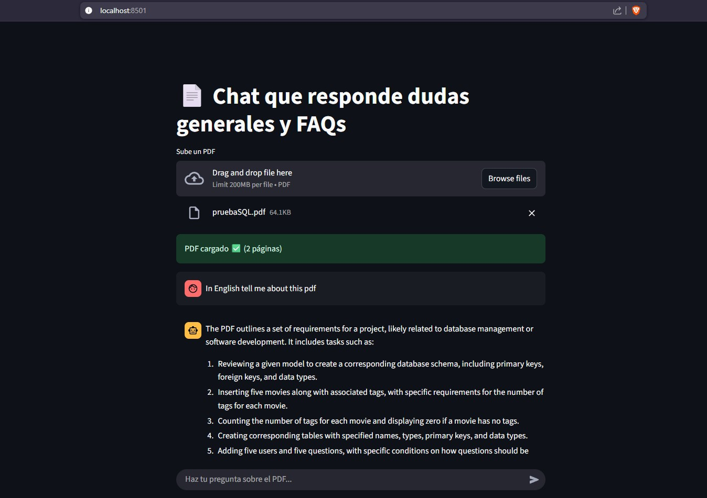

 

# 🤖 My First AI Agent on Telegram 

# PDF Chat and FAQs

This project is a web application built with Streamlit that allows users to upload a PDF file and ask questions about its content. It uses the OpenAI API to answer both general questions and FAQs based on the content of the provided PDF.



## Features
- **PDF Upload:** Users can upload a PDF file, and the system automatically extracts the text from all its pages.
- **Interactive Chat:** Chat interface where users can ask questions in Spanish about the uploaded PDF.
- **Intelligent Answers:** The assistant uses OpenAI's GPT-4o-mini model to respond, using the PDF content as context if available.
- **Conversation History:** Maintains the message history for a smooth conversational experience.

## Requirements
- Python 3.8+
- [Streamlit](https://streamlit.io/)
- [OpenAI Python SDK](https://github.com/openai/openai-python)
- [PyPDF2](https://pypi.org/project/PyPDF2/)
- [python-dotenv](https://pypi.org/project/python-dotenv/)

## Installation
1. Clone this repository:
  ```bash
  git clone https://github.com/Dave-Abr/Ai-Agent.git
  cd Ai-Agent
  ```
2. Install the dependencies:
  ```bash
  pip install -r requirements.txt
  ```
3. Create a `.env` file in the project root and add your OpenAI API key:
  ```env
  API_KEY=your_openai_key
  ```

## Usage
1. Run the application with Streamlit:
  ```bash
  streamlit run app.py
  ```
2. Open the web interface that will appear in your browser.
3. Upload a PDF file and start asking questions in the chat.

## Project Structure
- `app.py`: Main Streamlit application.
- `telegram_bot.py`: (Optional) Code for Telegram integration.
- `resource/`: Resource folder (sample PDFs, images, notebooks, etc).
- `README.md`: This file.

## Notes
- The assistant responds in Spanish.
- The OpenAI model used is configurable in the code (`gpt-4o-mini` by default).
- The PDF file is not stored on the server; it is only used during the active session.


